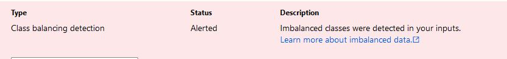

# Optimizing an ML Pipeline in Azure

## Overview

This project is part of the Udacity Azure ML Nanodegree.
In this project, we build and optimize an Azure ML pipeline using the Python SDK and a provided Scikit-learn model.
This model is then compared to an Azure AutoML run.

## Useful Resources

- [ScriptRunConfig Class](https://docs.microsoft.com/en-us/python/api/azureml-core/azureml.core.scriptrunconfig?view=azure-ml-py)
- [Configure and submit training runs](https://docs.microsoft.com/en-us/azure/machine-learning/how-to-set-up-training-targets)
- [HyperDriveConfig Class](https://docs.microsoft.com/en-us/python/api/azureml-train-core/azureml.train.hyperdrive.hyperdriveconfig?view=azure-ml-py)
- [How to tune hyperparamters](https://docs.microsoft.com/en-us/azure/machine-learning/how-to-tune-hyperparameters)

## Summary

**In 1-2 sentences, explain the problem statement: e.g "This dataset contains data about... we seek to predict..."**
In this project we have used UCI Bank Marketing dataset, which is related with direct marketing campaigns of a Portuguese baking institution. The classification objective (y) is to predict whether the customer will subscribe to a term deposit or not. More details about the data, can be found below.

**In 1-2 sentences, explain the solution: e.g. "The best performing model was a ..."**
In this project, we used Scikit-Learn logistic regression and trained the hyperparameters using HyperDrive. We also used AutoML to build and optimize a model on the same dataset so that we can compare the results of the two methods. The best model was obtained using AutoML - VotingEnsemble with an accuracy of 0.949.

## Scikit-learn Pipeline

**Explain the pipeline architecture, including data, hyperparameter tuning, and classification algorithm.**

#### Pipeline architecture

1. Setup Training Script
   - Import data using TabularDatasetFactory
   - Cleaning of data - handling NULL values, one-hot encoding of categorical features and preprocessing of date
   - Splitting of data into train and test data
   - Using scikit-learn logistic regression model for classification
2. Specify the hyperparameters and the Policy (see further at Hyperparameter Tuning)
3. Create a ScriptRunConfig Object and HyperDriveConfig
4. Train Model
5. Save the trained optimized model

#### Data
The data is related with direct marketing campaigns of a Portuguese banking institution. The marketing campaigns were based on phone calls. Often, more than one contact to the same client was required, in order to access if the product (bank term deposit) would be ('yes') or not ('no') subscribed.

There are four datasets:
1) bank-additional-full.csv with all examples (41188) and 20 inputs, ordered by date (from May 2008 to November 2010), very close to the data analyzed in [Moro et al., 2014]
2) bank-additional.csv with 10% of the examples (4119), randomly selected from 1), and 20 inputs.
3) bank-full.csv with all examples and 17 inputs, ordered by date (older version of this dataset with less inputs).
4) bank.csv with 10% of the examples and 17 inputs, randomly selected from 3 (older version of this dataset with less inputs).
The smallest datasets are provided to test more computationally demanding machine learning algorithms (e.g., SVM).

The classification goal is to predict if the client will subscribe (yes/no) a term deposit (variable y).

Within this project we are using the 2. dataset option. 

[Source](https://archive.ics.uci.edu/ml/datasets/Bank+Marketing)

#### Classification algorithm
As specified above, we have used logistic regression model for our binary classification problem and hyperdrive tool to choose the best hyperparameter values from the parameter search space. Under the hood logistic regression uses logistic/sigmoidal function to estimate the probabilities between the dependent/target variable and one or more independent variables(features). More information can be found here: https://de.wikipedia.org/wiki/Logistische_Regression

#### Hyperparameter tuning
**Parameter sampler**

I specified the RandomParameterSampling as follows:

`ps = RandomParameterSampling(
    {
        "--C": choice(0.5,1.0, 1.5),
        "--max_iter": choice(50, 75, 100, 125, 150)
    }
)`

I chose discrete values with choice for both parameters, *C* and *max_iter*.

*C* is the Regularization while *max_iter* is the maximum number of iterations.

**Early stopping policy**

An early termination policy is used to automatically terminate runs with poor performance to improve computational efficiency. In this project the BanditPolicy, which was specified as follows, is used:

`policy = BanditPolicy(evaluation_interval=2, slack_factor=0.1)`

**What are the benefits of the parameter sampler you chose?**
RandomParameterSampling is one of the available options for the sampler, and I chose it because it is the fastest and supports early termination of low power runs.
Another advantage of RandomParameterSampling , is it can use both discrete and continuous hyperparameters. 

**What are the benefits of the early stopping policy you chose?**
The early termination policy I chose is BanditPolicy because it is based on the slip factor and the scoring interval. Bandit aborts runs where the primary metric is not within the specified slip factor compared to the best performing run.

## AutoML
**In 1-2 sentences, describe the model and hyperparameters generated by AutoML.**

#### Procedure

1. Import data using TabularDatasetFactory
2. Cleaning of data - handling NULL values, one-hot encoding of categorical features and preprocessing of date
3. Splitting of data into train and test data
4. Configuration of AutoML
5. Save the best model generated

#### AutoML config
`automl_config = AutoMLConfig(
    experiment_timeout_minutes=30,
    task="classification",
    primary_metric="AUC_weighted",
    training_data=final_data,
    label_column_name="y",
    n_cross_validations=2,
    compute_target = aml_compute,
    enable_early_stopping = True)`
    

## Pipeline comparison
**Compare the two models and their performance. What are the differences in accuracy? In architecture? If there was a difference, why do you think there was one?**

Comparison of the two models and their performance. Differences in accuracy & architecture - comments

HyperDrive Model 	

AutoML Model 	

The model generated by the AutoML is better than the model generated by hyperparameter due to its accuracy. 

## Future work
**What are some areas of improvement for future experiments? Why might these improvements help the model?**

The classes to be predicted have an uneven distribution. For this reason I recommend the following 2 next steps:

1. To check or measure the fairness of the models (unequal size of the classes to be predicted)
2. Leverage additional interactive visualizations to assess which groups of users might be negatively impacted by a model and compare multiple models in terms of their fairness and performance (unequal size of the classes to be predicted)

Furthermore the hyperparameter values can be extended if time and budget allows longer runtimes. 

## Proof of cluster clean up
**If you did not delete your compute cluster in the code, please complete this section. Otherwise, delete this section.**
**Image of cluster marked for deletion**

