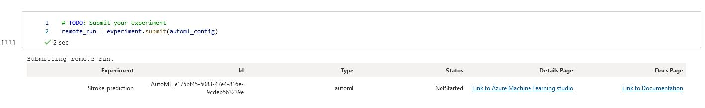
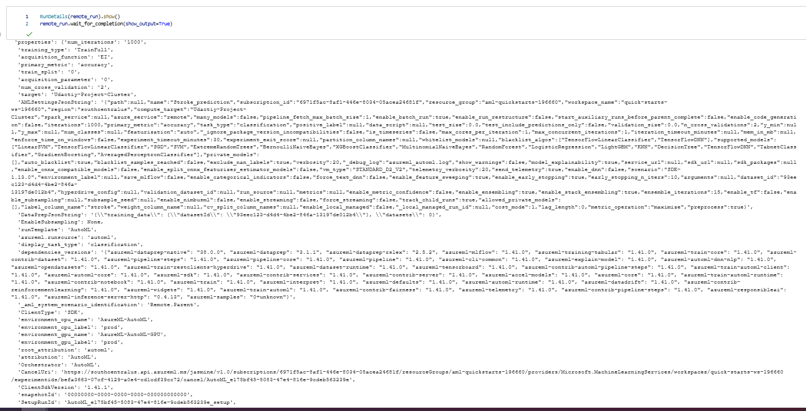
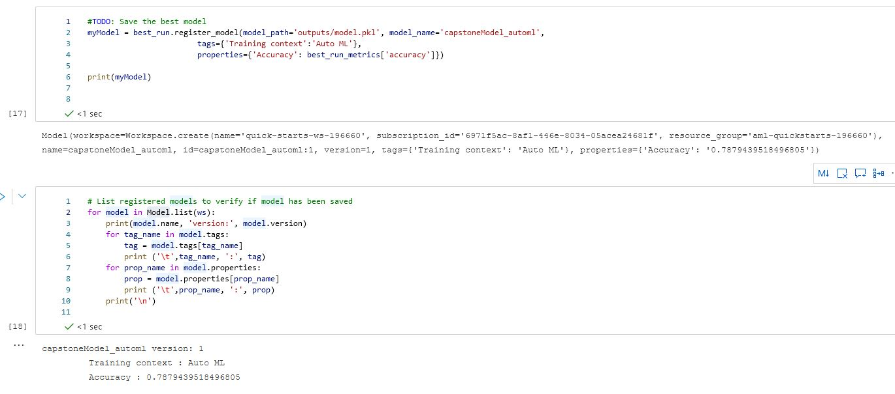
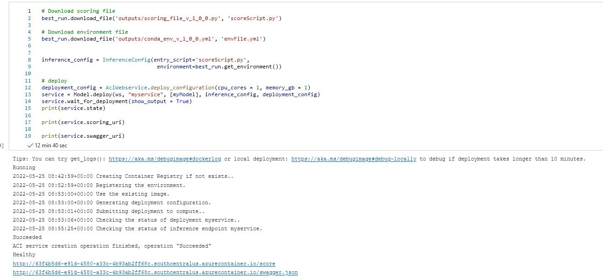
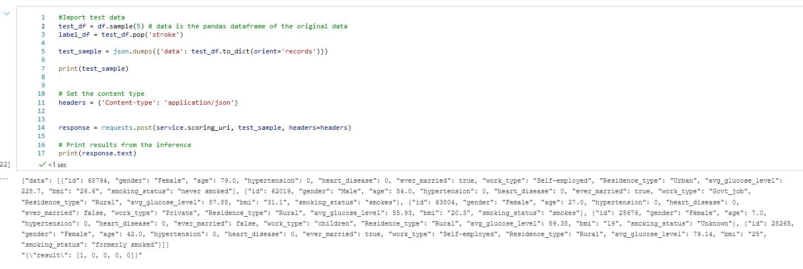
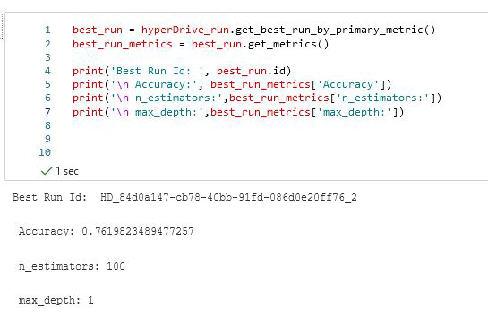
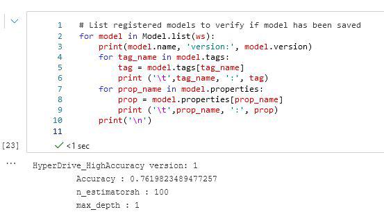
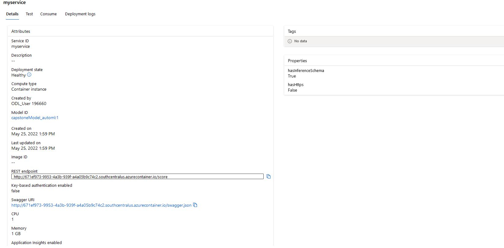

# Stroke Prediction

This is the Capstone project (last of the three projects) required for fulfillment of the Nanodegree Machine Learning Engineer with Microsoft Azure from Udacity. In this project, we use a dataset external to Azure ML ecosystem.

Azure Machine Learning Service and Jupyter Notebook is used to train models using both Hyperdrive and Auto ML and then the best of these models is deployed as an HTTP REST endpoint. 
The model endpoint is also tested to verify if it is working as intented by sending an HTTP POST request. Azure ML Studio graphical interface is not used in the entire exercise to encourage use of code which is better suited for automation and gives a data scientist more control over their experiment.

## Dataset
### Context

According to the World Health Organization (WHO) stroke is the 2nd leading cause of death globally, responsible for approximately 11% of total deaths.

### Overview
The data is provided via the following Kaggle source: https://www.kaggle.com/datasets/fedesoriano/stroke-prediction-dataset

The data is provided as a .csv file and ist structured as followed.

Attribute Information:
1) id: unique identifier
2) gender: "Male", "Female" or "Other"
3) age: age of the patient
4) hypertension: 0 if the patient doesn't have hypertension, 1 if the patient has hypertension
5) heart_disease: 0 if the patient doesn't have any heart diseases, 1 if the patient has a heart disease
6) ever_married: "No" or "Yes"
7) work_type: "children", "Govt_jov", "Never_worked", "Private" or "Self-employed"
8) Residence_type: "Rural" or "Urban"
9) avg_glucose_level: average glucose level in blood
10) bmi: body mass index
11) smoking_status: "formerly smoked", "never smoked", "smokes" or "Unknown"*
12) stroke: 1 if the patient had a stroke or 0 if not
*Note: "Unknown" in smoking_status means that the information is unavailable for this patient

### Task
This dataset is used to predict whether a patient is likely to get stroke based on the input parameters like gender, age, various diseases, and smoking status. Each row in the data provides relavant information about the patient.

### Access
The data is provided via the following Kaggle source: https://www.kaggle.com/datasets/fedesoriano/stroke-prediction-dataset

## Automated ML
Configuration and settings used for the Automated ML experiment are described in the table below:
|        Configuration       |                                                               Description                                                               |      Value     |
|:--------------------------:|:---------------------------------------------------------------------------------------------------------------------------------------:|:--------------:|
| experiment_timeout_minutes | This is used as an exit criteria, it defines how long, in minutes, your experiment should continue to run                               | 30             |
| primary_metric             | The metric that Automated Machine Learning will optimize for model selection                                                            | accuracy       |
| task                       | The type of task to run. Values can be 'classification',  'regression', or 'forecasting' depending on the type of automated ML  problem | classification |
| compute_target             | The compute target to run the experiment on                                                                                             | aml_compute    |
| training_data              | Training data, contains both features and label columns                                                                                 | dataset        |
| label_column_name          | The name of the label column                                                                                                            | Class          |
| n_cross_validations        | No. of cross validations to perform                                                                                                     | 2              |

### Results
In our experiment we found out VotingEnsemble to be the best model based on the accuracy metric. The accuracy score for this models was 0.78794.

### Improvements for AutoML

* Change experiment timeout, this would allow for more model experimentation but the longer runs may cost you more.
* We could use different primary metric as sometimes accuracy alone doesn't represent true picture of the model performance.
* Incresing the number of cross validations may reduce the bias in the model.

### AutoML Screenshots
Create Experiment 

RunDetails

BestModel

Save best model

Deploy model

Test API

## Hyperparameter Tuning
We use RandomForestClassifier algorithm from the SKLearn framework in conjuction with hyperDrive for hyperparameter tuning. There are two hyperparamters for this experiment, max_depth and n_estimators. 

* max_depth: The maximum depth of the tree. If None, then nodes are expanded until all leaves are pure or until all leaves contain less than min_samples_split samples.
* n_estimators: The number of trees in the forest.

We have used random parameter sampling to sample over a discrete set of values. Random parameter sampling is great for discovery and getting hyperparameter combinations that you would not have guessed intuitively, although it often requires more time to execute.

The parameter search space used for max_depth is [1,2,3,4,5] and for n_estimators is [100,200,300,400,500].

The benchmark metric (accuracy) is evaluated using hyperDrive early stopping policy. Execution of the experiment is stopped if conditions specified by the policy are met.

We have used the BanditPolicy. This policy is based on slack factor/slack amount and evaluation interval. Bandit terminates runs where the primary metric is not within the specified slack factor/slack amount compared to the best performing run. This helps to improves computational efficiency.

For this experiment the configuration used is; evaluation_interval=1, slack_factor=0.2, and delay_evaluation=5. This configuration means that the policy would be applied to every 1*5 iteration of the pipeline and if 1.2*value of the benchmark metric for current iteration is smaller than the best metric value so far, the run will be cancelled.

### Results
The highest accuracy that our RandomForestClassifier Model achieved was 0.76198. The hyperparameter that were used by this model are:

|        Hyperparameter       |                                                               Value                                                               |
|:--------------------------:|:---------------------------------------------------------------------------------------------------------------------------------------:|
| max_depth | 1 |
| min_samples_split | 100 |

### Improvements for hyperDrive

* Use Bayesian Parameter Sampling instead of Random; Bayesian sampling tries to intelligently pick the next sample of hyperparameters, based on how the previous samples performed, such that the new sample improves the reported primary metric.
* We could use different primary metric as sometimes accuracy alone doesn't represent true picture of the model performance.
* Increasing max total runs to try a lot more combinations of hyperparameters, this would have an impact on cost too.

### hyperDrive Screenshots
RunDetails

BestModel

Save model

Check if model is saved

## Model Deployment
To deploy a Model using Azure Machine Learning Service, we need following:

* A trained Model
* Inference configuration; includes scoring script and environment
* Deploy configuration; includes choice of deployment (ACI, AKS or local) and cpu/gpu/memory allocation

Scoring script is generated when a model is created. It describes the input data that model will expect and passes it to the model for prediction and returns the results. Following command can be used to retreive the scoring script; 
best_run.download_file('outputs/scoring_file_v_1_0_0.py', 'scoreScript.py').

We use the environment used by the best_run, the environment can be retreived by best_run.get_environment(). We can also download the yml file associated with the environment by using: 
best_run.download_file('outputs/conda_env_v_1_0_0.yml', 'envFile.yml')

For deployment we used Azure Container Instances with cpu_cores = 1 and memory_gb = 1

For Inference, the data passed to the model endpoint must be in JSON format. Following commands passes the data to the model as an HTTP POST request and records the response; response = requests.post(service.scoring_uri, test_sample, headers=headers)

Screenshots below show a demonstration of sample data response from the deployed model.

Test

Python example is available at the consume section inside our endpoint.

Endpoint

## Screen Recording
*TODO* Provide a link to a screen recording of the project in action. Remember that the screencast should demonstrate:
- A working model
- Demo of the deployed  model
- Demo of a sample request sent to the endpoint and its response

Link: https://youtu.be/-RL6c2eJOLA

