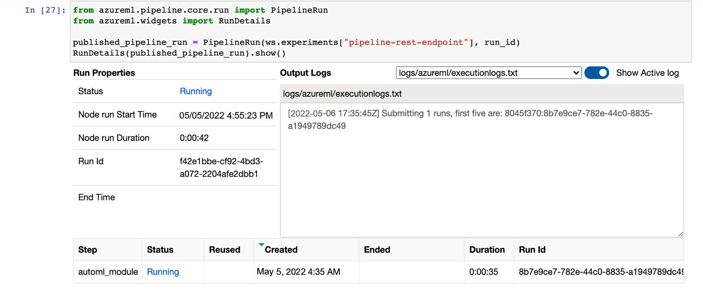

# Operationalizing Machine Learning

## Overview
This project is part of the Udacity Azure ML Nanodegree.
In this project, we use AutoML to train a best model, then operationalize it by following the workflow below. Both the `Azure ML Studio` and `Python SDK` were used in this project.

This diagram provides a visual summary of the workflow:


**Image credit: Udacity MLEMA Nanodegree**

Here is a summary of the workflow steps. A detailed account of the step executions is in the _**Architectural Diagram**_ section.

**1. Authentication**

This step used the `az cli` interface to log in to the `AML Studio`, then create a Service Principal (SP) to access the project workspace. As Udacity provisioned AML lab environment does not have sufficient privilege to create the SP, this step was not performed.

**2. Auto ML model**

This step used AML AutoML to train a collection of classification models on this [Bank Marketing dataset](https://automlsamplenotebookdata.blob.core.windows.net/automl-sample-notebook-data/bankmarketing_train.csv) and present the trained models in descending order of **AUC weighted accuracy**.

**3. Deploy the best model**

In this step, the top performing model, i.e. the one with the **best** *AUC weighted accuracy* was selected for deployment, and an endpoint to interact with the model was generated.

**4. Enable logging**

This step used `az cli` interface to enable Application Insights and retrieve logs of the operational health of the deployed model endpoint.

**5. Consume model endpoints**

In this step, a provided script was run in the `az cli` interface to make a request to the deployed model endpoint and display the response received. The payload data used for testing the endpoint was also saved to a json file named `data.json` for use in conducting a benchmarking test on the endpoint.

**6. Create and publish a pipeline**

This involved creating and publishig an endpoint for the AutoML training pipeline, allowing the training process to be automated.

**7. Documentation**

In this final step, a screencast was created to show the entire process of the working ML application, along with a README.md file to describe the project and document the main steps.

## Architectural Diagram

**Image credit: Udacity MLEMA Nanodegree**

A detailed account of the workflow steps illustrated in the architectural diagram is discussed here. The steps are grouped into 3 sub sections _**AutoML Model Training**_, _**Model Deployment**_ and _**Training Pipeline Automation**_.

### AutoML Model Training
This process consists of several steps involving setting up the training dataset and AutoML config, creating a pipeline to run the training process. The steps can be performed in either `AML Studio` or using `Python SDK`. I opted to use the project provided notebook `aml-pipelines-with-automated-machine-learning-step.ipynb` to complete the steps. This notebook is included in the project submission package. Refer to the notebook for code and step execution details. Below is an abstract of the key steps

**1. Dataset**

The dataset is provided via a .csv file. It can be uploaded into a dataset. 

This image shows the dataset was uploaded and registered successfully for use by the AutoML training.


**2. AutoML Config**

One way to create the AutoML model is by using the AutoML option from right of the frontend page of Azure ML. 

An alternative would be to create a AutoML run as later also shown in the video by using jupyter notebook. 

This code snippet shows the setup of AutoML config:

```python
automl_settings = {
    "experiment_timeout_minutes": 60,
    "max_concurrent_iterations": 5,
    "primary_metric" : 'AUC_weighted'
}
automl_config = AutoMLConfig(compute_target=compute_target,
                             task = "classification",
                             training_data=dataset,
                             label_column_name="y",
                             path = project_folder,
                             enable_early_stopping= True,
                             featurization= 'auto',
                             debug_log = "automl_errors.log",
                             **automl_settings
                            )
```

and this, the setup of AutoMLStep:

```python
automl_step = AutoMLStep(
    name='automl_module',
    automl_config=automl_config,
    outputs=[metrics_data, model_data],
    allow_reuse=True)
```

**3. Training Pipeline Creation and Run**

This code snippet illustrates creation of the training pipeline:

```python
from azureml.pipeline.core import Pipeline
pipeline = Pipeline(
    description="pipeline_with_automlstep",
    workspace=ws,
    steps=[automl_step])
```

and submission of the pipeline run:

```python
pipeline_run = experiment.submit(pipeline)
```

**4. Pipeline Run Monitoring**

The pipeline run was monitored from within the notebook with the RunDetails [Jupyter widget](http://jupyter.org/widgets) as shown here:


**5. Pipeline Run Completion**

The pipeline run successfully completed as shown in the series of screenshots presented below.

If you click on the `Run` link to drill down to the run Graph and Pipeline run overview:


The run produced a list of top performing models in descending order of _**AUC weighted accuracy**_. The best model topping the list is the one named `VotingEnsemble`:


Clicking the `VotingEnsemble` hyperlink revealed details of the best model:


 


**6. Conclusion**

The _**AutoML Model Training**_ process was successfully executed with a best model ready for deployment.

### Model Deployment
The process consists of a series of steps executed in both `AML Studio` and `az cli` interface.

**1. Deploy the Best Model**

This was done by clicking the _**Deploy**_ button from the best model _**Details**_ page on the _**Experiments**_ console in the `AML Studio`. The model was deployed to an **ACI** (Azure Container Instance) with authentication enabled as shown here:

When the deployment was done, an endpoint was generated along with a Swagger URI. This was visible from the _**Endpoints**_ console in the `AML Studio`. Notice that `Application Insights` was also already enabled.


**2. Enable Logging**

After the best model was successfully deployed, the next step was to run a provided python script named `logs.py` in the `az cli` interface to enable `Application Insights` and retrieve logs. This is the code snippet:

```python
from azureml.core import Workspace
from azureml.core.webservice import Webservice

# Requires the config to be downloaded first to the current working directory
ws = Workspace.from_config()

# Set with the deployment name
name = "best-model-deploy"

# load existing web service
service = Webservice(name=name, workspace=ws)

service.update(enable_app_insights=True)

logs = service.get_logs()

for line in logs.split('\n'):
    print(line)
```

For this script to execute successfully, the AML workspace configuration file `config.json` was downloaded and placed in the same folder as this script. 

The screenshot below shows successful execution of the `logs.py` script with `Application Insights` enabled and logs retrieved:


The _**Deployment**_ tab on the same page displayed logs received:


**3. Swagger Documentation**

Azure provides a [Swagger JSON file](https://swagger.io/) for deployed models. The Swagger URI (see the deployed model's _**Details**_ tab on the _**Endpoints**_ console in the `AML Studio`) was used to download the `swagger.json` file and saved to a folder where the scripts (`swagger.sh` and `serve.py`) for downloading Swagger Container and starting a Python web server on the local host reside.

Next `swagger.sh` and `serve.py` were started on the local host to stage a swagger instance with the documentation for HTTP API of the deployed model on the local host.

The `POST/score` method of the HTTP API looks like this:


**4. Consume Model Endpoint**

Next up, the best model endpoint was put to test by executing a python script `Consume endpoint.py` in the `az cli` interface. The script contains the model endpoint and authorization key (listed on the model's _**Consume**_ tab on the _**Endpoints**_ console in the `AML Studio`), posted a payload to the endpoint and displayed the response for the `POST` request. 

This screenshot shows the response from the `POST` request to the endpoint and the payload used for testing the endpoint was saved to the `data.json` file:


**5. Conclusion**

The _**Model Deployment**_ process was successfully executed producing a working best model endpoint, with a Swagger Documentation in tow and Application Insights enabled.

### Training Pipeline Automation

The process entails using `Python SDK` to publish the AutoML training pipeline, which can then be used to re-run the AutoML training pipeline on demand or schedule, thereby automating the AutoML training process. Additionally, publishing the pipeline enables a `REST` endpoint to rerun the pipeline from any HTTP library on any platform.

**1. Publish the AutoML training pipeline**

The pipeline used in AutoML Model training was published using `Python SDK`. This is the code snippet for publishing the pipeline:

```python
published_pipeline = pipeline_run.publish_pipeline(
    name="Bankmarketing Train", description="Training bankmarketing pipeline", version="1.0")

published_pipeline
```

The published pipeline object named `Bankmarketing Train` came with an endpoint and showed up on the _**Pipelines**_ console with an active status in the `AML Studio`, as shown here:


The pipeline endpoint was viewable from the _**Pipelines**_ console by clicking the published pipeline name `Bankmarketing Train` to get to the _**Details**_ tab, like so:


**2. Post a request to the endpoint to start a run**

The next step was to send a `POST` request to the endpoint with an Experiment object named `pipeline-rest-endpoint` to trigger the pipeline run:

```python
import requests

rest_endpoint = published_pipeline.endpoint
response = requests.post(rest_endpoint,
                         headers=auth_header,
                         json={"ExperimentName": "pipeline-rest-endpoint"}
                        )
```

The experiment was visible on the _**Experiment**_ console in the `AML Studio`:

Clicked on the Experiment `pipeline-rest-endpoint` link from the _**Experiments**_ console, a run `Run 1` was shown as running:

Clicked on `Run 1` link from the _**Experiments**_ console to see the Pipeline run overview on the _**Graph**_ tab. It had an active status and a `HTTP` Run type, proving the run was triggered by the `POST` request to the published pipeline endpoint.


**3. Monitor the Pipeline run with Jupyter widget**

The Pipeline run was monitored from within the notebook with the RunDetails [Jupyter widget](http://jupyter.org/widgets). It was shown as running:



**4. Conclusion**

The _**Training Pipeline Automation**_ process was successfully implemented using `Python SDK`, with a published pipeline capable of accepting `HTTP` requests through its endpoint.

## Screen Recording

A screencast demonstraing the entire process of the working ML application, including interactions with the deployed model and published pipeline endpoints is available here:

<a href="https://youtu.be/7a3okdzjVQk" target="_blank"></a>

## Future Improvements

Suggested areas of improvement:
* Benchmark API Endpoint
* Apply feature engineering


